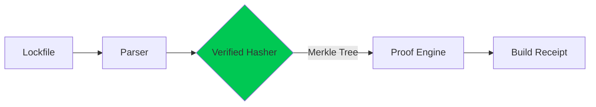

# Architecture: End-to-End Deterministic Build Pipeline

## Pipeline Overview
- **Lockfile:** Specifies all dependencies (name, version, checksum) for full reproducibility across environments.
- **Parser:** Reads and validates the lockfile, ensuring zero ambiguity in dependency resolution.
- **Verified Hasher:** Computes cryptographic hashes (e.g., SHA-384) of each dependency and build artifact. Guarantees transparency, enables tampering detection, and forms the root for merkleization.
- **Merkle Tree Construction:** Aggregates hashes in a tree structure for scalable, efficient proofs. Any change in any input creates a cascade to the root.
- **Proof Engine:** Mechanically verifies that build outputs match the expected Merkle root, validating not just dependency versions but bit-for-bit artifact reproducibility. Uses Kani and other formal tools to provide mathematically-guaranteed results.
- **Build Receipt:** Final public artifact (hash, timestamp, proof-of-build) ensuring cross-ecosystem verifiability—anyone can audit any build at any time.

## Threat Model & Security
- Adversarial input: Attacker attempts supply chain tampering by introducing malicious dependencies or manipulating build steps.
- Prevention: Chain of hashes + formal proofs = any unaudited change or non-reproducibility detected with mathematical certainty.

## Formal Verification & Trust Guarantees
- Every merge triggers full re-verification (using Kani & property-based tests).
- All hashes, proofs, and artifact receipts are public for maximal transparency.

## Reproducibility Across Toolchains
- Pipeline is tested on multiple OSes (Linux, Windows, macOS) and multiple package systems (npm, pip, Cargo).
- CI/CD integration runs all verification and audit checks for each environment.

## Extending and Auditing
- Plug-in system supports additional algorithms, output checks, or tagging governance policies.
- Verifiable logs, external audits, and reference outputs are publicly linked for review.

*See README for install & proof badge details.*
